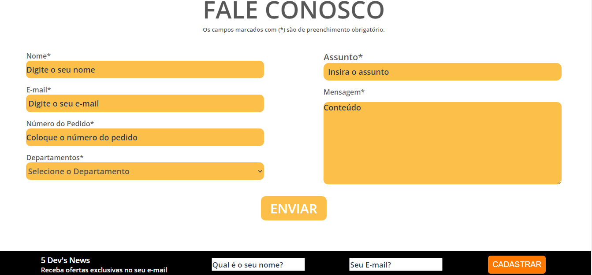
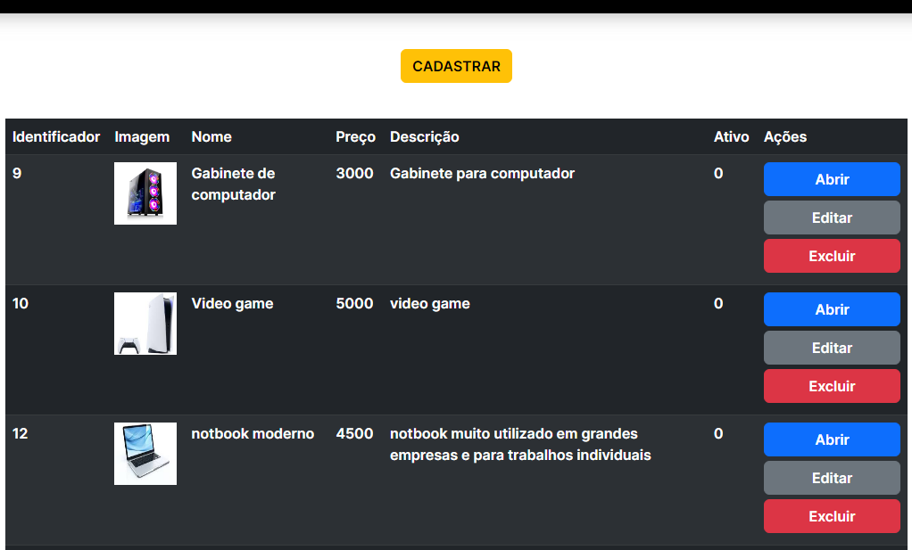
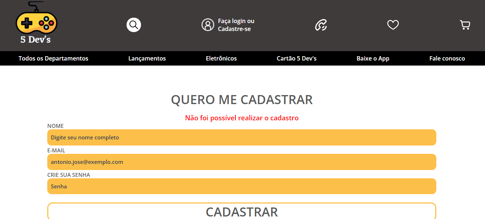
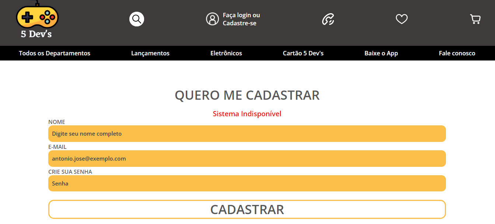

# 5Devs - Ecommerce

## About the project:
Proposed by DH, as a way for its students to
put into practice their studies and prepare for
the market, 5 Dev's was born. a platform
of digital E-commerce which we seek to meet the need
of our customers, in computer equipment and technology
generally. We opted for technology E-commerce, since it was the
market niche that had the highest growth (22.9%),
during the pandemic and is still growing.
Integrating Project that aims to
web development from scratch, from a separate application
visual (Front-end), to the logical part (Back-end).

## Tech Stack

Back-end: Node Js, express, javascript, SQL.

Front-end: EJS, HTML, CSS, Javascript, Bootstrap.

Wireframe: Figma (https://www.figma.com/files/project/55045725)

Design pattern: MVC

Banco de dados: Relacional, MySQL.

ORM: Sequelize

Metodologias Ágeis: SCRUM, Kanban.

## Environment variables
⚙️ Set the environment variables to the Sequelize communicate with the database server
````properties
DBUSER=
DBNAME=
DBPASS=
DBHOST= localhost
DBDIALECT= mysql
````
## How to run the project:

Install all the dependecies:
````bash
npm install
````
💡 Turn on the MySQL server 

Create the database with the `sequelize`
````bash
npx sequelize db:create
````
Create the database table with the sequelize
````bash
npx sequelize db:migrate
````
Run all the seeders to seed the database project table
````bash
npx sequelize db:seed:all
````
After install all the dependecies, create the database, database table and run all the seeders, we can start the server
````bash
npm nodemon index.js
````

## Author

- [@PauloHBLima](https://www.github.com/PauloHBLima)

## Screenshots


### Home Page


### contact us



### Admin screen (CRUD of products)



### Error Pages

* User already registered



* Database out of system

